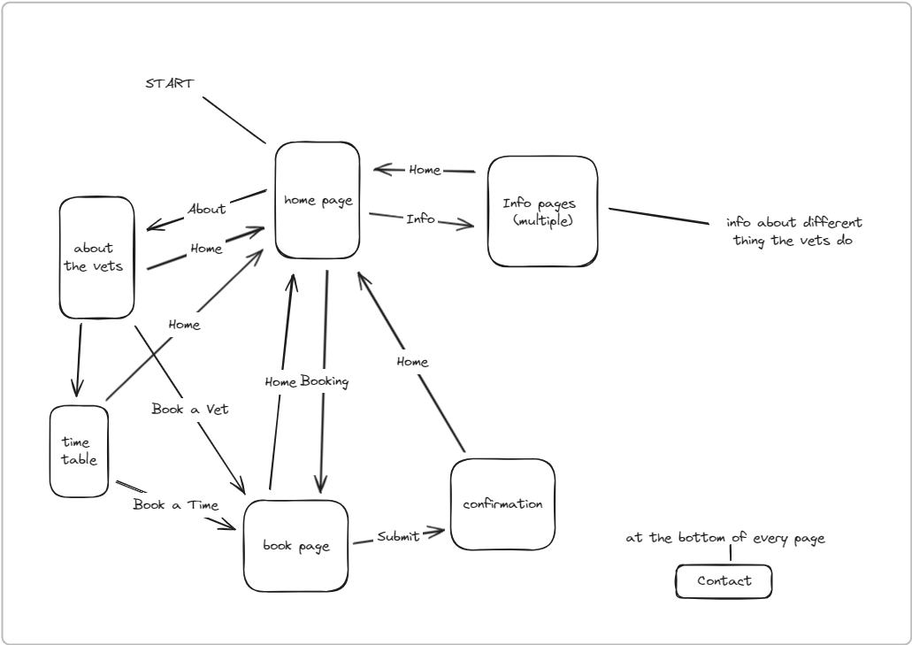

# The Design of a Database-Driven Web Application for NCEA Level 3

Project Name: **VetLife page** 

Project Author: **Jayden Mace**

Assessment Standards: **91902** and **91903**

-------------------------------------------------

## System Requirements

### Identified Need or Problem

my dad is a vet and if his clients want to talk to him they must call him this is bad because it interrupts him on his days off

### End-User Requirements

 VetLife needs a website that both VetLife costumers and the employees can use
the employees need a way to see when there on at home and what time they need to be places they will be going out to see people and helping people at the center 

customers or VetLife are people with sick animals or people needing help with the health and wellbeing of there animals during a significant proses they may be worried or scared for their animal friend.
the customers will want calming people and imagers on the website that instils a sense of trust and confidence in the workers of VetLife. They also would want a way to get vets to their homes quickly and effectively with easy to understand info readily available 
the users amy have very low IT exspereacs    

managers need a wey to effectively communicate to their employees about what their doing where to go that day with lists of what people have done and where they are going next   
   

### Proposed Solution

Im going to make a website for the Richmond VetLife it will allow customers 
- see when there fav vet is on and book his time 
- see what Expertise the vets there have  
- what they can do at the clinic 
- a map of where it is. one of the main fechers will be info about what the employees are good at and being able to book the right person for the job. 
 the manager will have different access to everyone so the they can change when people are on. 
 for the employees it will have forms of times that their on, that costumers can also see. 
 employees will be able to see where to go and who they will be helping but not the geasts as having peoples names and addresses for everyone to see will be bad   

-------------------------------------------------

## Relevant Implications

### Usability

Usability means that it is easy too use and quick if not instantly learnable  as most of the people using the site are probably not the most tech savey  

if the users of the website can not use it because it is too hard to use then it is useless so it has to be easy to understand and quick learn

I will need to think about thing like neillsen heuristics, who is using my webpage and what type of things they are looking for.  

### Health & Safety

this mean my website will not have any info that could harm animal if done by untrained hands

it is impotent that i do not give medical advice as people are untrained and my hurt there animals and i don't know anything about animal heath care 

i will need to consider that people may still try to call and ask what they can do or try to look through my website for info on how to save there animals i need to make it clear that the web site is made by someone who has no medical experience and that there will be no info no what to do to a animal just info on the vets and where the vets are and how to contact them  

### End-User

my end users will be my dad and the people he works with  

if I do not make the website design around that so all people can use it it will be useless 

because my dads costumers are mostly farmers not computer science majors I need to make it easy to use for people the use out of data technology   

-------------------------------------------------

## Relevant User Experience (UX) Principles

### Consistency

the use of Consistent colours, symbolise and layout   

it is important that when people come to the website that they are not confused where things are so I need to make the layout the same   

I will need to consider that the people using my website may get confused if the UI changes on every page so it has to stay consistent 

### useful

is should be useful. it wont just be a website that has a few photos and some name of vets but has things that people want to use my website for when there's some thing wrong with there animals 

it is important that when trying to make it useful i don't make it hard to use as if no mater how useful it is if all the people wanting to use it cant it will not be useful
with that in mind i will need to consider the simplicity and the how much it has to offer the as if i don't if i don't make i simle yet useful website it will only be useful to a small minority of people   

### Hierarchy

that there will be a clear difference in what the boss of VetLife the workers and the customers see and interact with 

if the workers can change thing they may get rid of things they do not want to do or mess with other peoples time and if the customers can they might too 

Replace this text with an explanation of what you will need to consider moving forward and how the project will be impacted by this principle.
i will need to have certen resorses available too the admins only and make the pages check if the user is an admin so people don't just go to them ver the URL    

-------------------------------------------------
## Final System Design

### Database Structure

### User Interface Design

Place images here that show your *final design* of your UI: layout, colours, etc.

-------------------------------------------------

## Completed System

### Database Structure

Place a image here that shows the *actual database structure* that you implemented: tables, fields and relationships.

### User Interface Design

Place screenshots and notes here that show your *actual system UI* in action.

-------------------------------------------------

## Review and Evaluation

### Meeting the Needs of the Users

Replace this text with a brief evaluation of how well you met the needs of your users. Look at what you initially wrote about who they are, what specific needs they have, etc. and discuss how well the system meets those needs.

### Meeting the System Requirements

Replace this text with a brief evaluation of how well you met the requirements that you defined at the start of the project, etc. Look back at the list of features / functionality you initially set and discuss how well your system has implemented each one.

### Review of IMPLICATION NAME HERE

Replace this text with brief notes showing how the implication was addressed in the final outcome. Accompany the notes with screenshots / other media to illustrate specific features.

### Review of IMPLICATION NAME HERE

Replace this text with brief notes showing how the implication was addressed in the final outcome. Accompany the notes with screenshots / other media to illustrate specific features.

### Review of IMPLICATION NAME HERE

Replace this text with brief notes showing how the implication was addressed in the final outcome. Accompany the notes with screenshots / other media to illustrate specific features.

### Review of UX PRINCIPLE NAME HERE

Replace this text with brief notes showing how the UX principle was addressed in the final outcome. Accompany the notes with screenshots / other media to illustrate specific features.

### Review of UX PRINCIPLE NAME HERE

Replace this text with brief notes showing how the UX principle was addressed in the final outcome. Accompany the notes with screenshots / other media to illustrate specific features.

### Review of UX PRINCIPLE NAME HERE

Replace this text with brief notes showing how the UX principle was addressed in the final outcome. Accompany the notes with screenshots / other media to illustrate specific features.

-------------------------------------------------