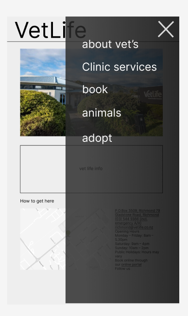

# Development of a Database-Driven Web Application for NCEA Level 3

Project Name: **VetLife page****

Project Author: **Jayden Mace**

Assessment Standards: **91902** and **91903**

-------------------------------------------------

## Design, Development and Testing Log

### DATE HERE

the over all desin of the webpage 

after a brief discussion with my end user he suggested that I do pop out bar on the side for when the users are on there phone
Replace this text with brief notes describing what you worked on, any decisions you made, any changes to designs, etc. Add screenshots / links to other media to illustrate your notes where necessary.

> Replace this text with any user feedback / comments
as seen in the photo I added a pop up will show up when you click the mean button ( ≡ )

Replace this text with notes describing how you acted upon the user feedback: made changes to design, etc.

### DATE HERE

Replace this test with what you are working on

Replace this text with brief notes describing what you worked on, any decisions you made, any changes to designs, etc. Add screenshots / links to other media to illustrate your notes where necessary.

> Replace this text with any user feedback / comments

Replace this text with notes describing how you acted upon the user feedback: made changes to design, etc.

### DATE HERE

Replace this test with what you are working on

Replace this text with brief notes describing what you worked on, any decisions you made, any changes to designs, etc. Add screenshots / links to other media to illustrate your notes where necessary.

> Replace this text with any user feedback / comments

Replace this text with notes describing how you acted upon the user feedback: made changes to design, etc.

### DATE HERE

Replace this test with what you are working on

Replace this text with brief notes describing what you worked on, any decisions you made, any changes to designs, etc. Add screenshots / links to other media to illustrate your notes where necessary.

> Replace this text with any user feedback / comments

Replace this text with notes describing how you acted upon the user feedback: made changes to design, etc.

### DATE HERE

Replace this test with what you are working on

Replace this text with brief notes describing what you worked on, any decisions you made, any changes to designs, etc. Add screenshots / links to other media to illustrate your notes where necessary.

> Replace this text with any user feedback / comments

Replace this text with notes describing how you acted upon the user feedback: made changes to design, etc.

### DATE HERE

Replace this test with what you are working on

Replace this text with brief notes describing what you worked on, any decisions you made, any changes to designs, etc. Add screenshots / links to other media to illustrate your notes where necessary.

> Replace this text with any user feedback / comments

Replace this text with notes describing how you acted upon the user feedback: made changes to design, etc.

