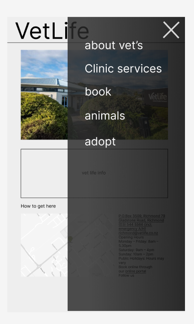
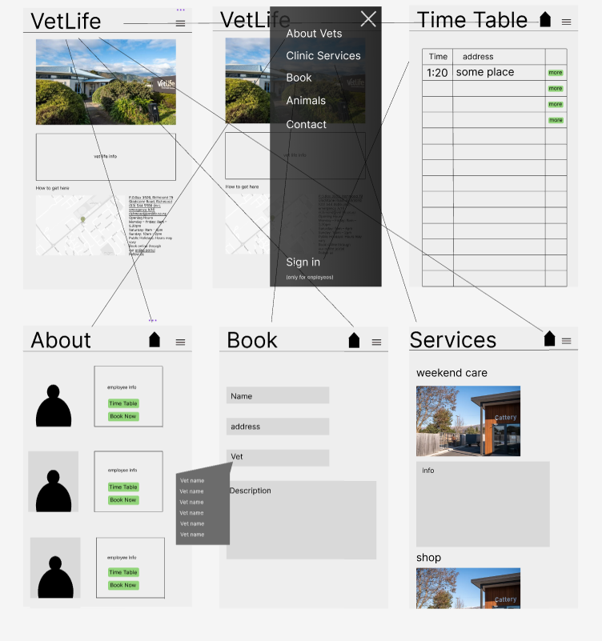
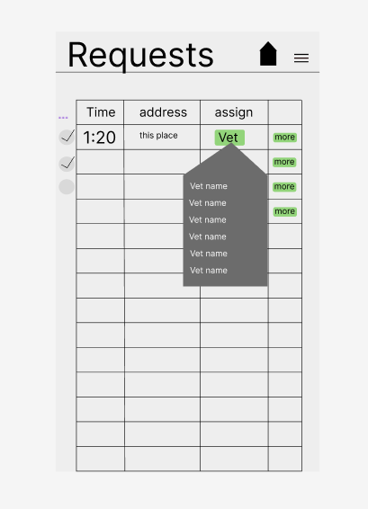
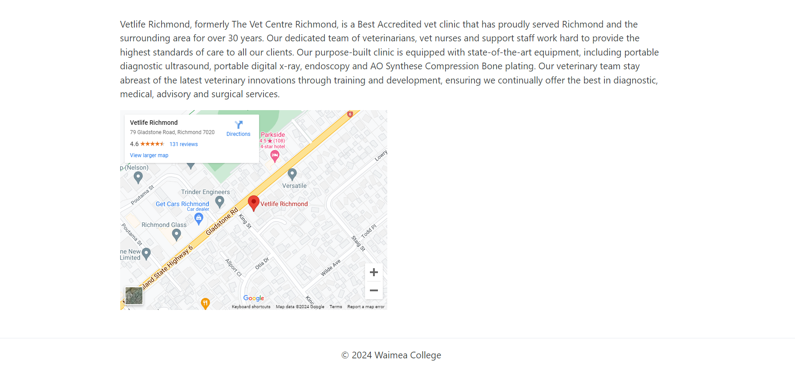
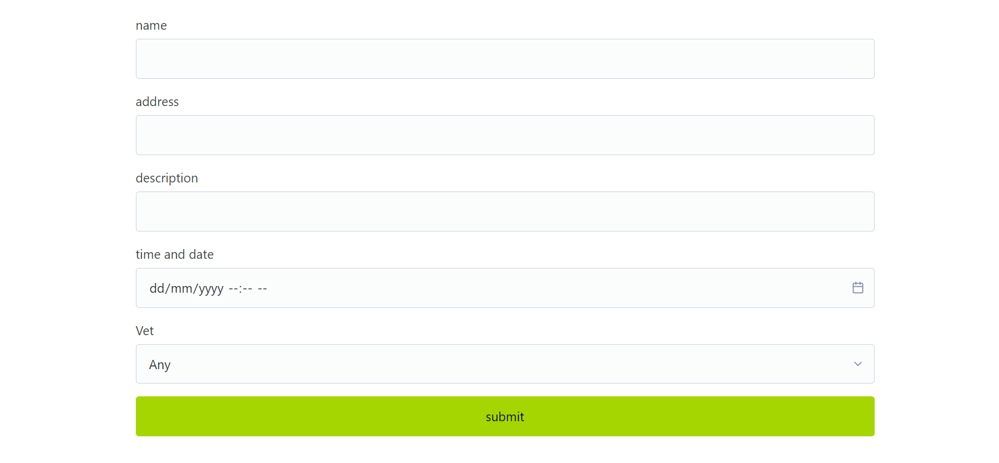

# Development of a Database-Driven Web Application for NCEA Level 3

Project Name: **VetLife page****

Project Author: **Jayden Mace**

Assessment Standards: **91902** and **91903**

-------------------------------------------------

## Design, Development and Testing Log

### DATE HERE

I worked on the over all desin of the webpage 

after a brief discussion with my end user he suggested that I do pop out bar on the side for when the users are on there phone

as seen in the photo I added a pop up will show up when you click the mean button ( ≡ )

### DATE HERE

I talked to my end user and got feed back on what i should change and add 

after talking to my end user and got feed back on what I should change and add this is what my wep page was like before 
 

this is what he said 

8/06/2024  - John	 

I’m nervous about customers making bookings themselves.  Any requests need to go through to the clinic staff so they can book it.  I am in constant communication with front desk staff – telling them where I am and where I am going next. 

Make sure that any customers booking me, know this. IE any booking needs to be confirmed by the clinic. 

It is a bit concerning that people can see my schedule – I won't be able to have a sleep under a tree in Tapawera! 

Sounds like a good idea – customers can see when I am currently available and get themselves organized in advance. See when we both have time available. 

form Johns feed back I changed the way the is system going to work

and added another page for confirmation just for the manager

### DATE HERE

I showed 1 of my end user the pages I had done he suggested I put a map on it so it is easy to find where VetLife is in richmond 

in response to this I added a map on the 23/07/2024 

### DATE HERE

the booking of vets  

got the booking working 

### DATE HERE

the handing out of jobs 

> Replace this text with any user feedback / comments

Replace this text with notes describing how you acted upon the user feedback: made changes to design, etc.

### DATE HERE

Replace this test with what you are working on

Replace this text with brief notes describing what you worked on, any decisions you made, any changes to designs, etc. Add screenshots / links to other media to illustrate your notes where necessary.

> Replace this text with any user feedback / comments

Replace this text with notes describing how you acted upon the user feedback: made changes to design, etc.

